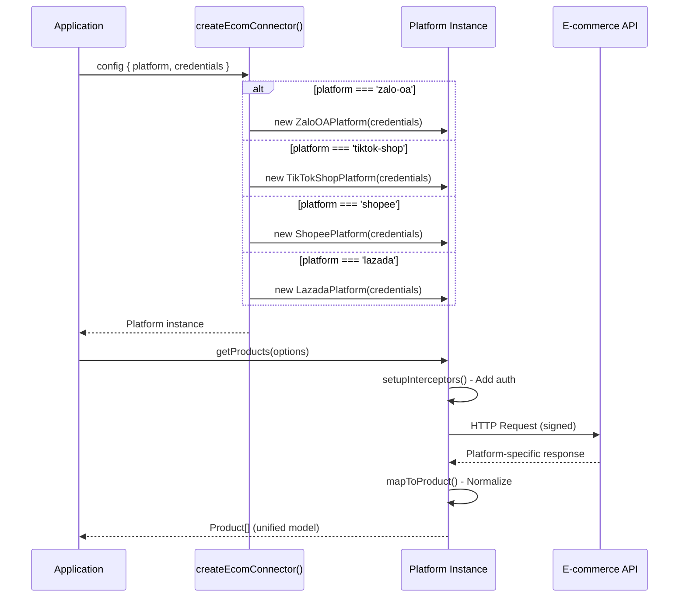
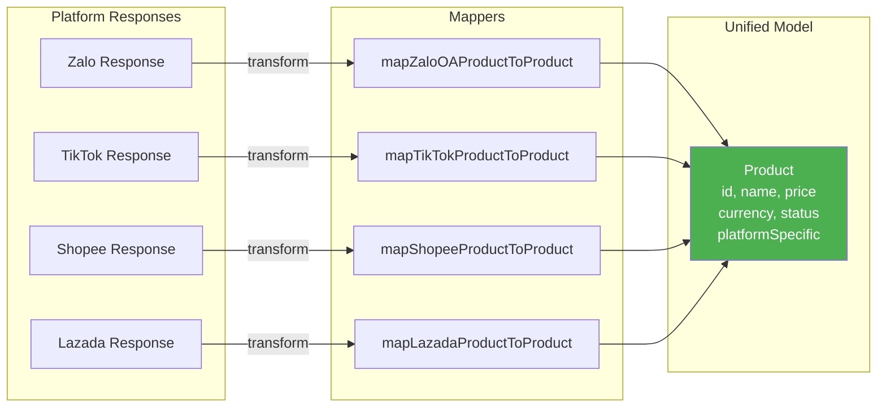
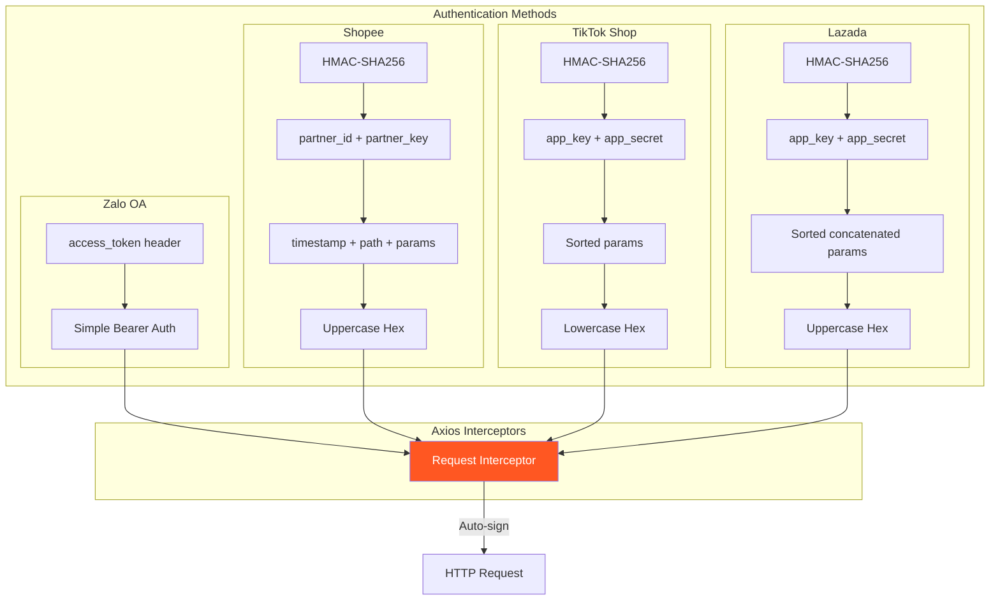
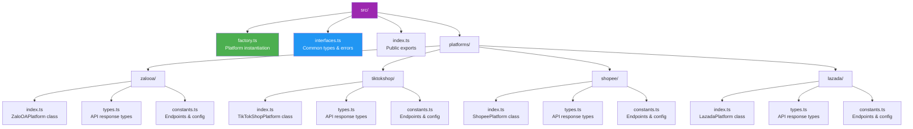
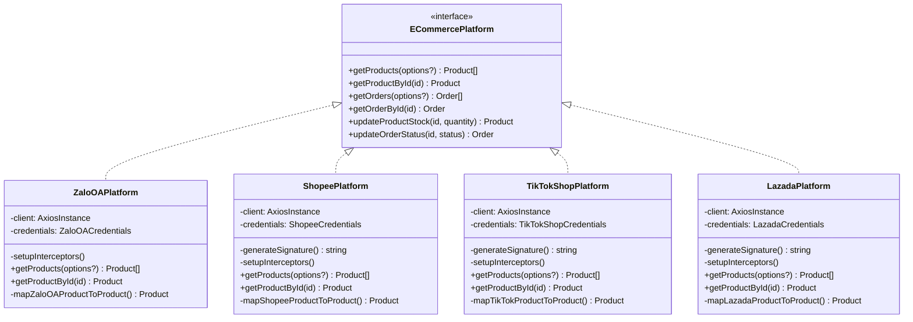
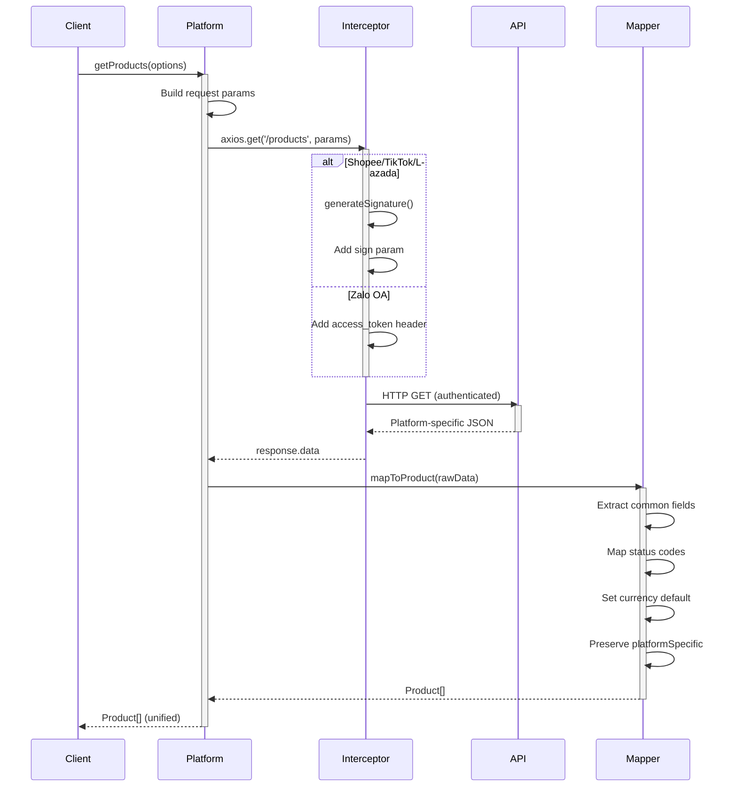
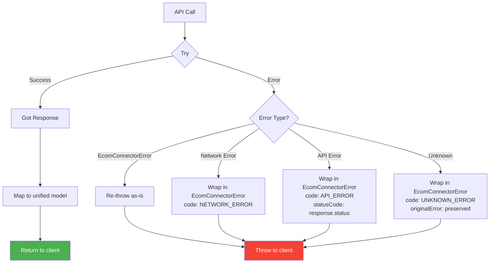
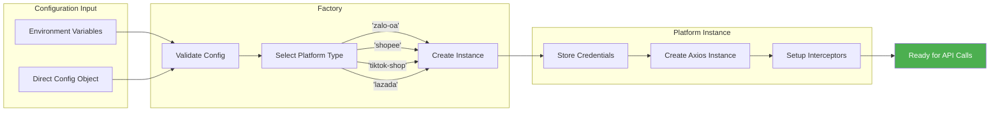

# Sơ Đồ Kiến Trúc - ecom-connector

## 1. Kiến Trúc Tổng Quan

```mermaid
graph TB
    subgraph "Client Application"
        APP[Application Code]
    end

    subgraph "ecom-connector Package"
        FACTORY[Factory<br/>createEcomConnector]
        INTERFACE[ECommercePlatform<br/>Interface]
        
        subgraph "Platform Implementations"
            ZALO[ZaloOAPlatform]
            TIKTOK[TikTokShopPlatform]
            SHOPEE[ShopeePlatform]
            LAZADA[LazadaPlatform]
        end
        
        subgraph "Common Models"
            PRODUCT[Product Model]
            ORDER[Order Model]
            CUSTOMER[Customer Model]
        end
        
        subgraph "Utils"
            TRANSFORM[Data Transformers]
            ERROR[EcomConnectorError]
        end
    end

    subgraph "External APIs"
        ZALO_API[Zalo OA API]
        TIKTOK_API[TikTok Shop API]
        SHOPEE_API[Shopee API]
        LAZADA_API[Lazada API]
    end

    APP -->|config| FACTORY
    FACTORY -->|creates| ZALO
    FACTORY -->|creates| TIKTOK
    FACTORY -->|creates| SHOPEE
    FACTORY -->|creates| LAZADA
    
    ZALO -.implements.- INTERFACE
    TIKTOK -.implements.- INTERFACE
    SHOPEE -.implements.- INTERFACE
    LAZADA -.implements.- INTERFACE
    
    ZALO -->|normalizes to| PRODUCT
    ZALO -->|normalizes to| ORDER
    TIKTOK -->|normalizes to| PRODUCT
    TIKTOK -->|normalizes to| ORDER
    SHOPEE -->|normalizes to| PRODUCT
    SHOPEE -->|normalizes to| ORDER
    LAZADA -->|normalizes to| PRODUCT
    LAZADA -->|normalizes to| ORDER
    
    ZALO -->|HTTP + Auth| ZALO_API
    TIKTOK -->|HTTP + HMAC| TIKTOK_API
    SHOPEE -->|HTTP + HMAC| SHOPEE_API
    LAZADA -->|HTTP + HMAC| LAZADA_API
    
    ZALO -.uses.- TRANSFORM
    TIKTOK -.uses.- TRANSFORM
    SHOPEE -.uses.- TRANSFORM
    LAZADA -.uses.- TRANSFORM
    
    ZALO -.throws.- ERROR
    TIKTOK -.throws.- ERROR
    SHOPEE -.throws.- ERROR
    LAZADA -.throws.- ERROR

    style FACTORY fill:#4CAF50,color:#fff
    style INTERFACE fill:#2196F3,color:#fff
    style PRODUCT fill:#FF9800,color:#fff
    style ORDER fill:#FF9800,color:#fff
    style CUSTOMER fill:#FF9800,color:#fff
```

## 2. Factory Pattern Flow

## 3. Data Normalization Pattern

## 4. Authentication Strategies

## 5. File Structure Architecture

## 6. Interface Implementation Pattern

## 7. Data Flow cho getProducts()

## 8. Error Handling Flow

## 9. Config & Credentials Flow

## 10. Các Thành Phần Chính

### Factory (Entry Point)
- **File**: `src/factory.ts`
- **Chức năng**: Nhận config, chọn platform, tạo instance
- **Pattern**: Factory Pattern

### Platform Implementations
- **Zalo OA**: Simple token auth
- **Shopee**: HMAC-SHA256 (uppercase hex)
- **TikTok Shop**: HMAC-SHA256 (lowercase hex)  
- **Lazada**: HMAC-SHA256 (uppercase hex)

### Common Models
- `Product`: id, name, price, currency, status, platformSpecific
- `Order`: id, status, totalAmount, items[], customer
- `OrderItem`: productId, quantity, price
- `Customer`: id, name, email, phone

### Error Handling
- `EcomConnectorError`: Unified error with code, message, statusCode, originalError

## Lưu Ý Quan Trọng

1. **Single Responsibility**: Mỗi platform class chỉ xử lý 1 nền tảng
2. **Data Normalization**: Tất cả response được chuẩn hóa về common models
3. **platformSpecific Field**: Lưu trữ raw data gốc để preserve vendor-specific fields
4. **Authentication**: Tự động inject vào mọi request qua axios interceptors
5. **Timestamp Handling**: Chuyển đổi giữa seconds/milliseconds cho Date objects
6. **No External Dependencies**: Chỉ dùng axios, không dùng moment/lodash
